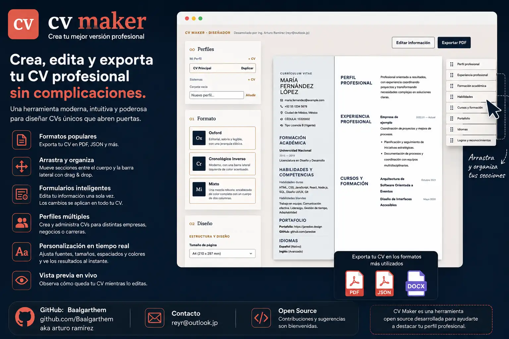

¡Bienvenido a **CV Maker**! La herramienta definitiva de escritorio diseñada para profesionales que buscan destacar. Construir tu currículum nunca había sido tan elegante, rápido y seguro.

## ¿Por qué elegir CV Maker?

Olvídate de las típicas frustraciones de usar plantillas de Word genéricas, donde añadir una simple línea de texto adicional o una nueva experiencia laboral arruina por completo todo el diseño, los márgenes y el acomodo de las páginas. 

Con **CV Maker**, tú te enfocas en **qué** decir, y el sistema se encarga de **cómo** se ve. 

-  **Diseños Inteligentes y Automáticos**: A diferencia de Word, aquí el diseño se adapta a tu contenido de forma inteligente. Cambia entre estilos profesionales (como el formato *Oxford*, *Mixto* o *Cronológico Inverso*) con un solo clic.
-  **Personalización Atómica**: ¿Quieres que tu nombre destaque más? ¿O que tu experiencia tenga un espaciado más limpio? Nuestro diseñador visual interactivo te permite ajustar la tipografía, colores y márgenes de forma milimétrica sin desconfigurar jamás el resto del documento.
-  **Privacidad Total (Offline)**: A diferencia de los generadores web, todos tus datos personales, tu fotografía y tu historial profesional se guardan localmente en tu propia computadora. Sin nubes de terceros, sin cuentas de pago, sin riesgos de privacidad.
-  **Exportación Perfecta a PDF**: Genera un archivo PDF nítido, pulcro y listo para enviar a los reclutadores en segundos, garantizando que tu CV se vea exactamente igual en la pantalla de cualquier empresa.

En resumen: **CV Maker es tu asistente personal de carrera.** Introduce tu información una vez y genera un currículum de impacto, siempre.

---

## 📥 Descargas

¿Listo para empezar a crear currículums perfectos? Descarga la versión más reciente, lista para instalar y usar (no requiere conocimientos técnicos):

[⬇️ Descargar CV Maker para Windows (.exe)](https://github.com/Baalgarthem/cv-maker/releases)


Solo ejecuta el instalador, y en cuestión de segundos tendrás el programa listo en tu escritorio.

---

## 👨‍💻 Para desarrolladores

Si deseas explorar el código fuente, contribuir o compilar tu propia versión del programa, esta sección es para ti. Ten en cuenta que la lógica de negocio y documentos de arquitectura internos han sido ocultados del control de versiones.

### Tecnología empleada

- **Frontend**: TypeScript, React y Vite (Interfaz moderna, interactiva y rápida).
- **Backend y Empaquetado**: Tauri v2 y Rust (Genera instaladores `.exe` nativos de Windows, rápidos y ultra ligeros).
- **Persistencia**: LocalStorage y SQLite (Base de datos local, portable y sin servidor).

Esta arquitectura hiper-optimizada prioriza Windows, ofreciendo un rendimiento inigualable y dejando atrás el enorme peso tradicional de aplicaciones basadas en Electron.

### Primeros comandos

Asegúrate de contar con Node.js LTS, Rust estable y las herramientas de compilación de C++ (Visual Studio Build Tools) instaladas en tu sistema.

```powershell
npm install          # Instalar dependencias del frontend
npm run dev          # Iniciar servidor de desarrollo en el navegador
npm run tauri:dev    # Ejecutar la aplicación en modo ventana nativa para depuración
npm run tauri:build  # Compilar y empaquetar el instalador final
```

El comando `npm run tauri:build` compila automáticamente el programa completo y genera los instaladores finales optimizados (`.exe` y `.msi`) dentro de la ruta `src-tauri/target/release/bundle/`.
